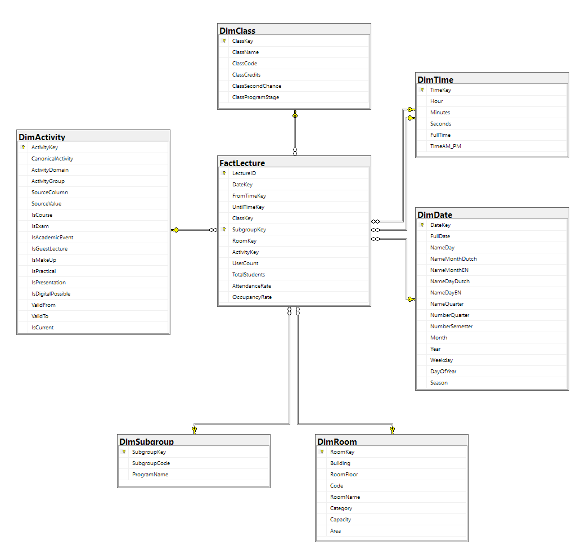

# DEP2 - 2025-2026 - groep12

Groepsleden: Emile Velghe, Korneel Grumieaux, Mikail In, Semih Malcikan en Yoran De Rop De Beukelaer

Dit project gaat over geanonimiseerde wifi data te scrapen van wifi routers en hiermee de totaal aanwezigheid en bezetting van een lokaal op een les per les basis te bepalen.

## Project opstarten

### DWH aanmaken - vullen

Om dit project op te starten, verbind eerst met SQL Server via de DWH-tunnel en maak de twee databases aan op de VM: DEP2 en DEP2_staging. Voer de creation query.sql (SQLStaging- en SQLTableCreationQuery.sql) bestanden uit op de DWH. Deze bevinden zich in `/dwh`. Om deze tabellen op te vullen gebruik de .py en .ipynb bestanden in dezelfde folder. Deze zijn vernoemd naar de tabel(len) die ze opvullen bv. fill_dimRoom zal DEP2 dimRoom opvullen, script_DimTime zal DEP2 DimTime opvullen.

### Nieuwe data

Sommige scripts in de `/scraping` map maken gebruik van de API waarvoor een geheim token nodig is. Plaats dit token in een .env-bestand in dezelfde map (`/scraping`) met de volgende regel:

```ini
SECRET=token_hier
```

- Nieuwe reservation data in .csv formaat plaatsen in folder: `/data/incoming` en scripts uitvoeren in `/dwh/lectures`
- Nieuwe OLODs - scrapet ibamaflex: `/scraping/class_scraping.py` - `/scraping/class_processing.ipynb`
- Nieuwe studenten - overloopt reservatie data van `/scraping/unique_classgroups_schedule.ipynb` en haalt studenten op via [dep2.simondg.com](dep2.simondg.com) - `/scraping/students.ipynb`
- Nieuwe wifi data: `scraping/wifi_script.py`

### Cronjobs

Er zijn 3 cronjobs die om de 15 minuten worden uitgevoerd:

```bash
*/15 * * * * /usr/bin/python3 /home/vicuser/DEP2-2025-2026-groep12/scraping/wifi_script.py
*/15 * * * * cd /home/vicuser/DEP2-2025-2026-groep12 && /usr/bin/python3 /home/vicuser/DEP2-2025-2026-groep12/dwh/UserCountTotalStudents.py
*/15 * * * * cd /home/vicuser/DEP2-2025-2026-groep12 && /usr/bin/python3 /home/vicuser/DEP2-2025-2026-groep12/dwh/OccupancyRate.py
```

## Analysis

Hier zitten enkele bestanden die handig kunnen zijn bij het controleren van waarden.

- studentcountpersubgroep.ipynb: Telt het aantal studenten per subgroep

- userattandence.ipynb: Maakt een dataframe aan van de aanwezige studenten via de staging database.

## Data

Hier wordt alle data opgeslagen.

`archived`: Alle oude reservatie data wordt hierin bewaard

`classgroups`: Alle subgroepen opgehaald uit reservatie data via API van [dep2.simondg.com](dep2.simondg.com)

`cleaned`: Hier zit alle geformatte en opgeschonde data in

`incoming`: Nieuwe opgelaade reservatie data

`week1_4_wifi`: Wifidata van de eerste 4 weken gekregen van lectoren.

## Dwh

Hier in zitten alle scripts en bestanden om via .csv bestanden de datawarehouse en de database tabellen te creëren.

### Python:

- fill_dimroom.py: Verbindt met de database en vult tabel `dimRoom`
- fill_reservations.py: Verbindt met de database en vult tabel `FactLecture`
- script_dimdate.py: Verbindt met de database en vult tabel `dimDate`
- script_dimsubgroep.py: Verbindt met de database en vult tabel `dimSubgroep`
- script_dimtime.py: Verbindt met de database en vult tabel `dimTime`
- script_staging_dimuser_bridgeusb.ipynb: Verbindt met de staging database en vult tabel `BridgeUserSubgroup`

### SQL:

- SQLCreateDimActivity.sql: Maakt tabel `dimActivity` aan en vult deze.
- SQLFillOccupancyRate.sql: Updates tabel 'FactLecture' kolom OccupancyRate gebaseerd op lokaal capaciteit.
- SQLFillUserCountTotalStudents.sql: Vult tabel `FactLecture` 'UserCount' en 'TotalStudents' via de staging database
- SQLStagingCreationQuery.sql: Maakt tabellen `dimUser`,`BridgeUserSubgroup` en `FactWifiConnection` aan in staging database.
- SteekProevenWeek10_11.sql: Script voor steekproeven van week 10 en 11 op te halen rechtstreeks uit database.

`lectures`: Alle scripts die te maken hebben met database tabel FactLecture.

- fillFactLectures.py: Verbindt met de database en vult tabel `FactLecture`
- FormatLectures.py: Formateert lecture bestanden om deze te kunnen inlanden op de database.
- MergeLectures.py: Voegt alle lecture bestanden samen tot één bestand.

## Database



## Staging database


## Machine Learning

- ml.ipynb: Traint modellen op de data van `FactLecture` om het aantal aanwezige studenten te kunnen voorspellen.

## Power-bi

- PowerBI_reports.pbix: Power BI-dashboard bestand.

## Scraping

- class_processing.ipynb: Kuist en formateert gescrapte OLODS en vult database tabel `DimClass`.
- class_scraping.py: Scrapt alle OLODS van hogent.
- lokalen.ipynb: Kuist en formateert gekregen bestand van lokalen.
- reservations_clean_merge.ipynb:Kuist en formateert reservatie bestanden.
- students.ipynb: Haalt alle studenten op via API van [dep2.simondg.com](dep2.simondg.com) via gescrapte subgroepen in reservatie data.
- unique_classgroups_schedule.ipynb: Haalt alle unieke klasgroepen op uit reservatie data.
- week1_4_wifi.ipynb: Zet gekregen wifidata van de eerste 4 weken om tot bruikbare data.
- wifi_script.py: Scrapte wifi van de laaste 15 minutes via API van [dep2.simondg.com](dep2.simondg.com)
- wifi_script2_backup.py: Backup scraper van wifi data in geval van VM problemen.
